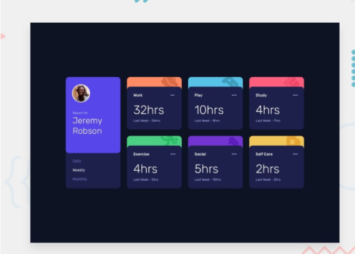

<h2>Time Tracking Dashboard</h2>

This is my solution to <strong>Time Tracking Dashboard</strong> challenge by Frontendmentor.io.

<h3>Live Link</h3>
<a href="https://sonakshirawat.github.io/Time-tracking-dashboard/">Click here</a>

<h3>Features</h3>
<ul>
<li>Switch between viewing Daily, Weekly, and Monthly stats</li>
<li>See the hover states for all the interactive elements on the page</li>
<li>View the optimal layout for the site depending on their device's screen size</li>
</ul>

 
<h3>Build Using</h3>
<ul>
  <li>HTML5 Markup language</li>
  <li>CSS3 Custom Properties</li>
     <li>Vanilla javascript</li>
</ul>

<h3>Screenshots</h3>
 
<!-- 

 

 -->